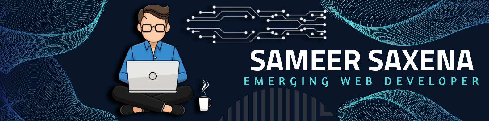

<h1 align="center">👋 Hi, I'm Sameer Saxena</h1>

  <a href="http://sameersaxenaportfolio.netlify.app/">🌐 Portfolio</a> •
  <a href="https://www.linkedin.com/in/sameer-saxena-428215218">💼 LinkedIn</a> •
  <a href="https://www.hackerrank.com/profile/2101640100230_CS">🌟 Hackerrank</a> •
  <a href="https://leetcode.com/u/Sameer__22/">🔍 LeetCode</a> •
  <a href="mailto:saxenasameer022@gmail.com">✉️ Contact</a>

  
  
  
  
  

## 🧑‍💻 About Me

I'm an enthusiastic **Full-Stack Developer** with a strong passion for building responsive and user-friendly web applications. Currently pursuing my degree at **Pranveer Singh Institute of Technology**, I'm on a mission to leverage technology to solve real-world problems.

## 🚀 Skills

- **Programming Languages**: Python, Java, C, JavaScript, HTML, CSS, SQL
- **Frameworks**: React, Node.js, Express.js, Socket.IO
- **Databases**: MySQL, MongoDB
- **Tools**: Git, GitHub, VS Code, Command Prompt, Jupyter Notebook
- **Libraries**: NumPy, Pandas, OpenCV, TensorFlow
- **Soft Skills**: Strategic Communication, Verbal Communication, Interpersonal Skills

## 📚 Education

- **Pranveer Singh Institute of Technology College** (2021-2025) | CGPA: 7.9
- **Mercy Memorial School** | Intermediate: 89.4% | High School: 89.0%

## 🌟 Achievements

- **5th place** among 300 teams in the ACPC Hackathon at ABES College
- **5 Star Coder** on Hackerrank
- Solved **300+ problems** on LeetCode

## 📊 GitHub Stats

  

### 💻 Programming Languages

  

### 🗓️ Contributions

  

### 🧩 Repo Stats

  

## 🤝 Let's Connect

- 📧 Email: [saxenasameer022@gmail.com](mailto:saxenasameer022@gmail.com)
- 💼 LinkedIn: [Sameer Saxena](https://www.linkedin.com/in/sameer-saxena-428215218)

  

